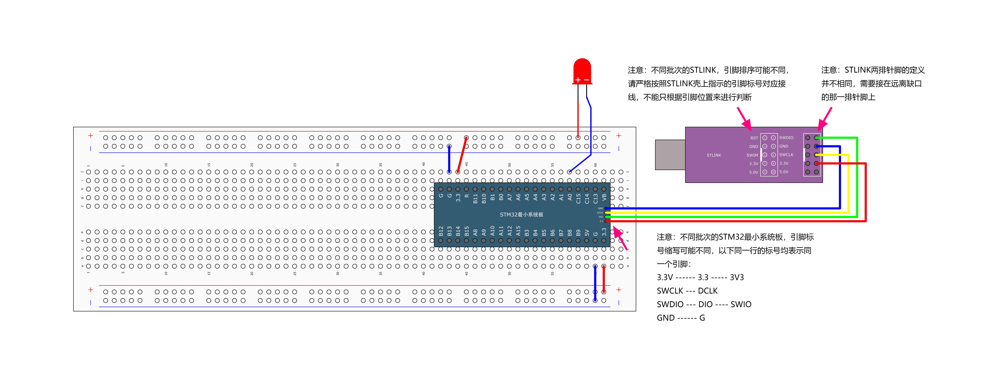
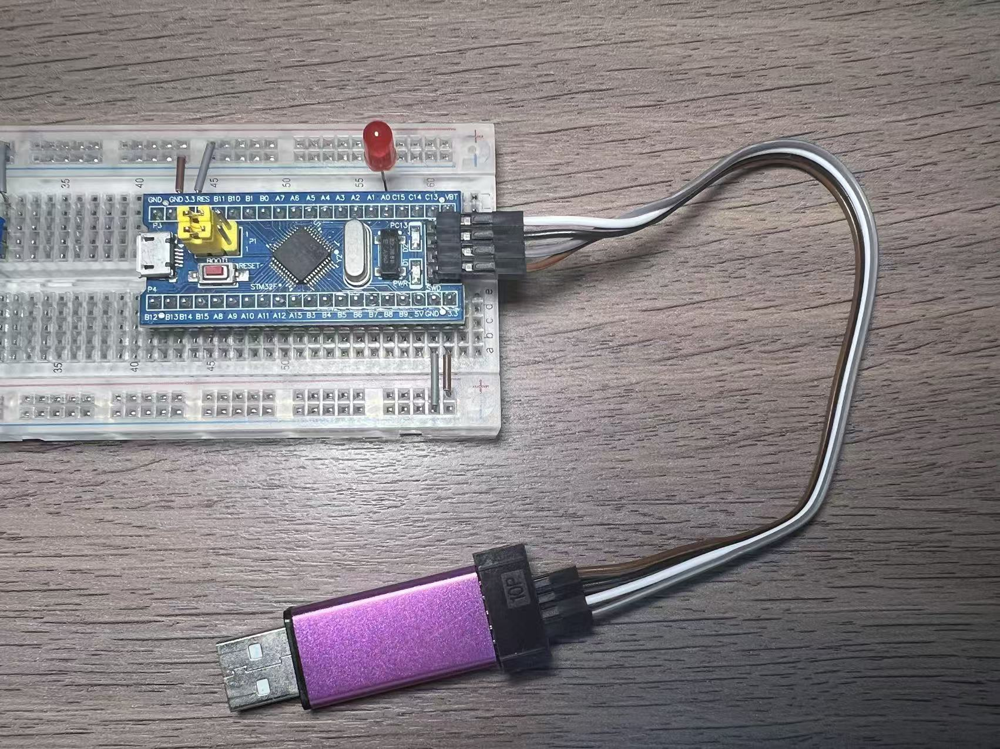

## 1.接线示意图



## 2.接线实物图



## 3.GPIO是什么

GPIO（通用输入输出口）就像单片机上的“开关”和“检测口”，每个引脚可以设置为：

- **输出模式**：控制引脚输出高电平（约3.3V）或低电平（0V）——用来**点亮LED、控制外设**。
- **输入模式**：读取引脚上的电平高低——用来**检测按键、接收信号**。
- 如果想要弄清楚GPIO的8种输入输出模式，在我的[这篇文章](https://mp.weixin.qq.com/s/O-QMAHL9Z7-HOBmbcWp5eg)中有详细讲解。

> 💡 简单理解：输出模式就是“单片机命令外部设备”，输入模式就是“单片机读取外部信号”。

## 4.输出模式：推挽 vs 开漏

控制LED，我们主要用**输出模式**，常见两种：

1. **推挽输出**：能输出强高电平和强低电平（**最常用**，驱动能力强）。
2. **开漏输出**：只能输出低电平或“断开”（高电平没输出能力），一般需要外接电阻。

> ✅ 对于LED，通常直接用**推挽输出**就行。

## 5.LED 怎么接？

- LED是发光二极管，**长脚（正极）**接STM32的GPIO引脚，**短脚（负极）**接一个电阻再到GND（地）。
- 电阻的作用是限制电流，保护LED和单片机（常用220Ω~1kΩ）。

> 🔄 当GPIO输出**高电平**时，LED两端有电压差，灯亮；输出**低电平**时，LED熄灭。

## 6.操作步骤

使用STM32CubeMX工具配置工程时，默认会生成基于HAL库的代码框架，从而避免直接操作复杂的底层寄存器。主要步骤包括：

### **6.1. 新建工程**

- 打开 CubeMX → 选择你的 STM32 型号（如 STM32F103C8T6）。

### **6.2. 配置时钟（关键说明）**

- **默认使用内部时钟（HSI）**，无需外接晶振也能运行（精度较低，但 LED 闪烁够用）。
- 如需更高精度，可在 **"Clock Configuration"** 选项卡中启用 **HSE（外部晶振）** 并配置 PLL。

### **6.3. 配置 GPIO**

- 在引脚图中将目标引脚（如 PA0）设为 **GPIO_Output**。

### **6.4. 生成代码**

- 选择 IDE（如 Keil/STM32CubeIDE）→ 点击 **Generate Code**。

### **6.5. 编写代码（main.c）**

```
while(1) {
  HAL_GPIO_TogglePin(GPIOA, GPIO_PIN_0);  // 翻转电平
  HAL_Delay(500);  // 延时500ms
}
```

### **6.6. 编译下载**

**为什么不用外置晶振也能用？**

- STM32 内置 **HSI（8MHz RC振荡器）**，默认作为系统时钟源，适合基础应用（如 LED 控制）。
- 外置晶振（HSE）通常用于需高精度的场景（如 USB、串口通信）。

> 总结：**不配时钟 = 用内部 HSI，简单够用；配时钟 = 更精准，适合复杂项目。**

------

✅ 你只需要：

- 知道GPIO可以输出高低电平；
- 会用STM32CubeMX配置引脚；
- 会调用`HAL_GPIO_WritePin()`和`HAL_Delay()`函数。

这样就足够让LED闪烁了！其他细节（上拉下拉、输入模式、开漏等）后续用到再学。

## 7.实战演示

