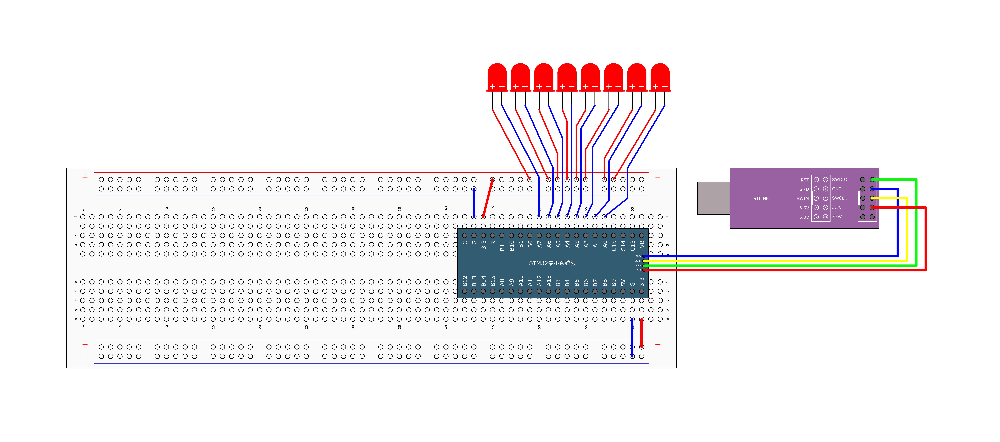

## 接线原理图

## 接线实物图

## 实现步骤

### 硬件连接

将其他LED灯正确连接到STM32的相应GPIO引脚（如PA1、PA2、PA3等），这里还是一样，暂时不给LED串联适当阻值的限流电阻。

### 软件配置

在`main`函数的`while`循环中，添加对其他GPIO口的控制代码，按照自己想要的流水灯模式设置各LED的亮灭状态和时间。

## 效果定制

通过独立调整每个LED的点亮时长和熄灭时机，可以自由创造出各种流水灯效果，如顺序点亮、逆序流动、交替闪烁等不同模式。