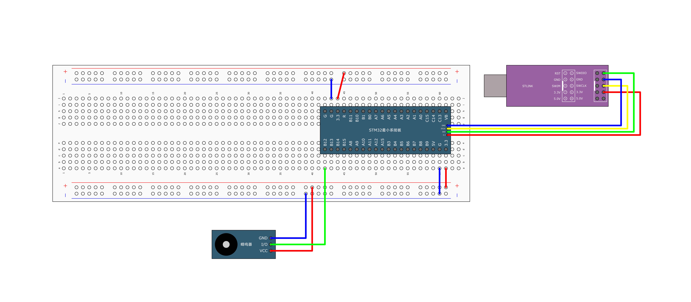
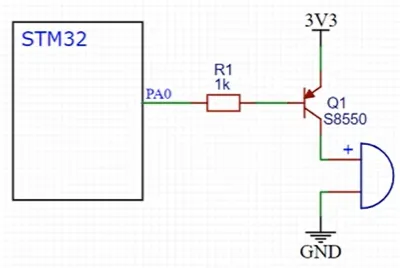
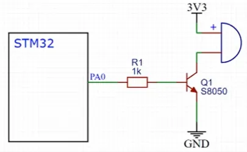
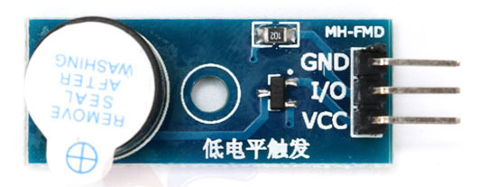

## 接线原理图



## 接线实物图

## 蜂鸣器类型

- **有源蜂鸣器**：内部自带振荡源，只需接通直流电源即可持续发声，频率固定
- **无源蜂鸣器**：需要外部提供脉冲信号才能发声，通过改变脉冲频率可产生不同音调

## 驱动电路

使用三极管开关电路驱动是最简单的方案。

当需要驱动功率较大的蜂鸣器时，直接用IO口驱动可能对单片机负担过重，三极管驱动电路可以很好地完成这个任务。

| 低电平触发                 | 高电平触发                 |
| -------------------------- | -------------------------- |
|  |  |

这里选用的模块是低电平触发的有源蜂鸣器



**工作原理**：
 当GPIO输出低电平时，三极管导通，蜂鸣器通电发声；输出高电平时，三极管截止，蜂鸣器停止发声。


**代码示例**：

```
// 有源蜂鸣器控制
HAL_GPIO_WritePin(BUZZER_GPIO_Port, BUZZER_Pin, GPIO_PIN_SET); // 开启蜂鸣器
HAL_Delay(100); // 响100ms
HAL_GPIO_WritePin(BUZZER_GPIO_Port, BUZZER_Pin, GPIO_PIN_RESET); // 关闭蜂鸣器
```

