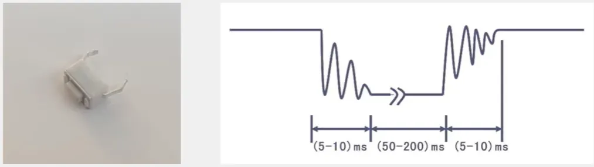

## 接线原理图

## 接线实物图

## 按键介绍

**1. 什么是按键？**
 按键是一种常见的电子输入元件。其基本工作原理是：当手指按下时，内部电路导通；当手指松开后，电路便恢复断开。

**2. 为何需要消抖？**
 由于按键通常依靠内部的弹性金属片实现通断，在按下和松开的瞬间，金属片会产生物理性的机械振动。这会导致电信号在短时间内出现一系列不稳定的快速跳变，而不是一次清晰的电平变化，这种现象称为“按键抖动”。如果程序直接读取此信号，可能会误判为多次按键。

**3. 如何实现消抖？**

- **软件消抖**：最简单的方法是在首次检测到按键状态变化后，延时约10-20毫秒，待抖动结束后再读取稳定电平状态，以此准确判断按键动作。
- **硬件消抖**：也可通过附加电路（如RC滤波电路或施密特触发器）对信号进行整形，从物理层面滤除抖动。

- 最常用的就是软件消抖，加一个延时等待，再判断高低电平就可以了

## 整体步骤

**1. 准备工作**
 先把LED和按键的线接好，设置好初始状态

**2. 主循环
 程序跑起来后就干三件事：

- 👉 检查按键有没有被按
- 👉 处理按下的按键
- 👉 继续回头检查

**3. 按键检测要靠谱**

- 发现按键按下先等20ms（防抖）
- 确认是真的按下了才干活
- 等手指松开了再执行操作

**4. LED反应要迅速**

- 按键确认后立马切换LED状态
- 亮就变灭，灭就变亮

## 实战演示
