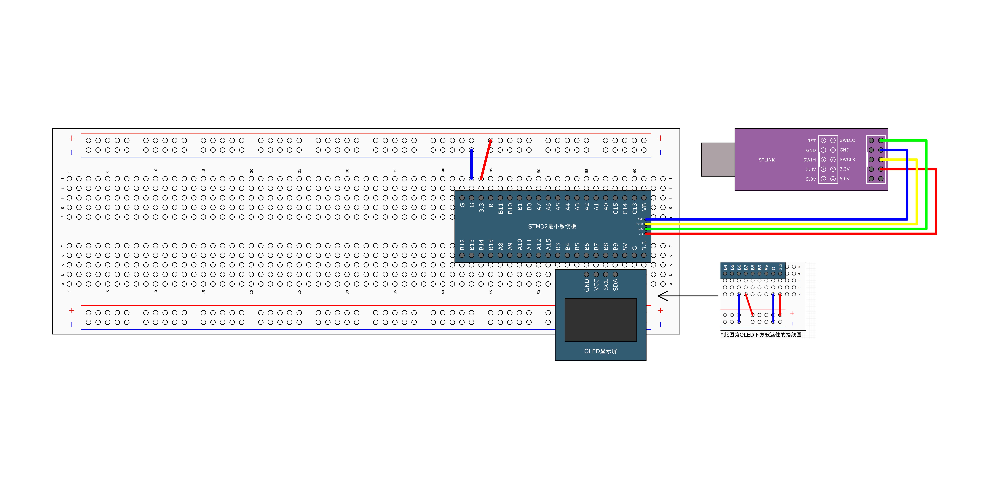
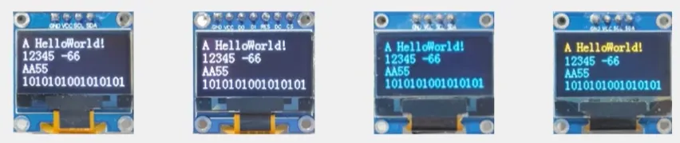

## 接线原理图

## 接线实物图

## OLED显示屏介绍

- **OLED (Organic Light Emitting Diode)：**有机发光二极管
- **OLED显示屏︰**性能优异的新型显示屏，具有功耗低、**响应速度快**、**宽视角**、轻薄柔韧等特点
- **0.96寸OLED模块：**小巧玲珑、占用接口少、简单易用，是电子设计中非常常见的显示屏模块
- **供电∶**3~5.5V		**通信协议：**I2C/SPI		**分辨率∶**128*64

图中的比较经典的一款屏幕，有7针脚和4针脚的，颜色是固定的。

最后一款的颜色也是固定的，只有1/3的显示黄色，剩下的显示蓝色。

## 整体思路

## 实战演示